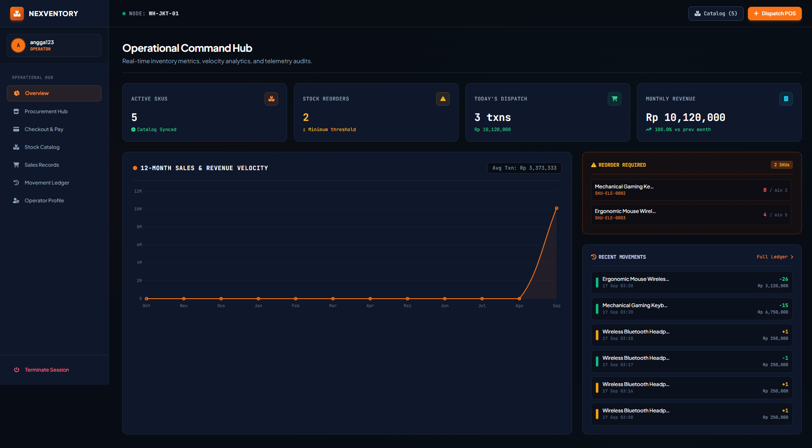
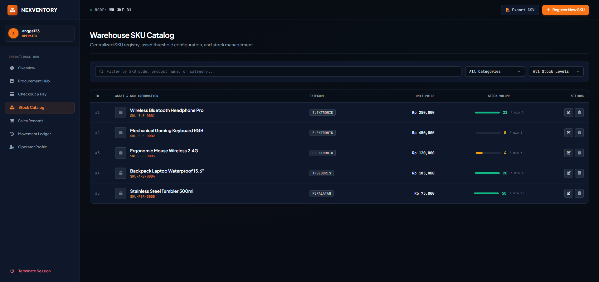
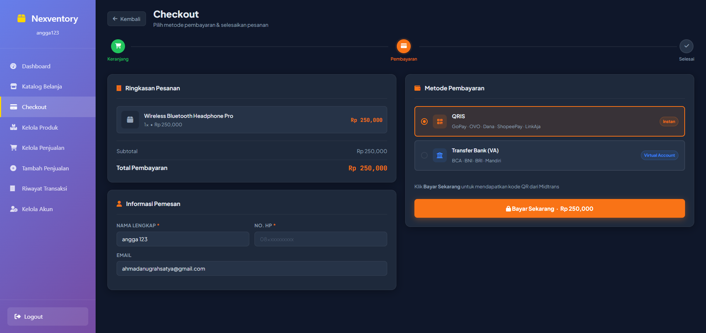
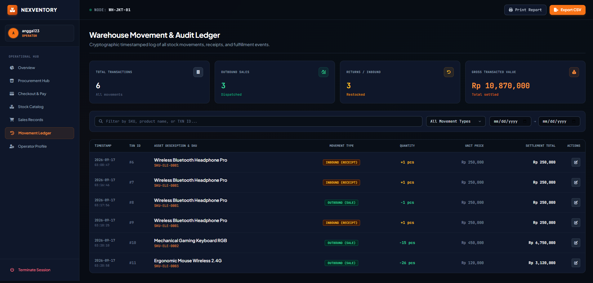
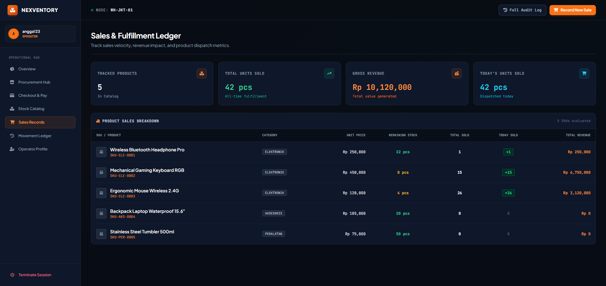
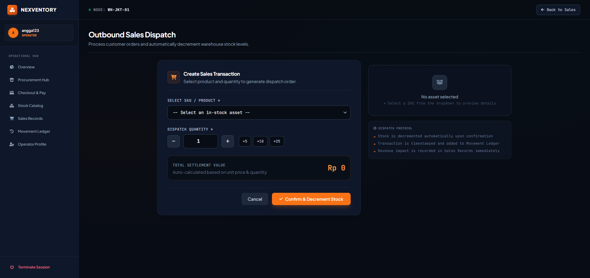
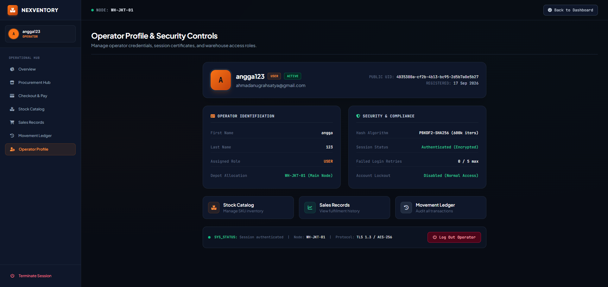
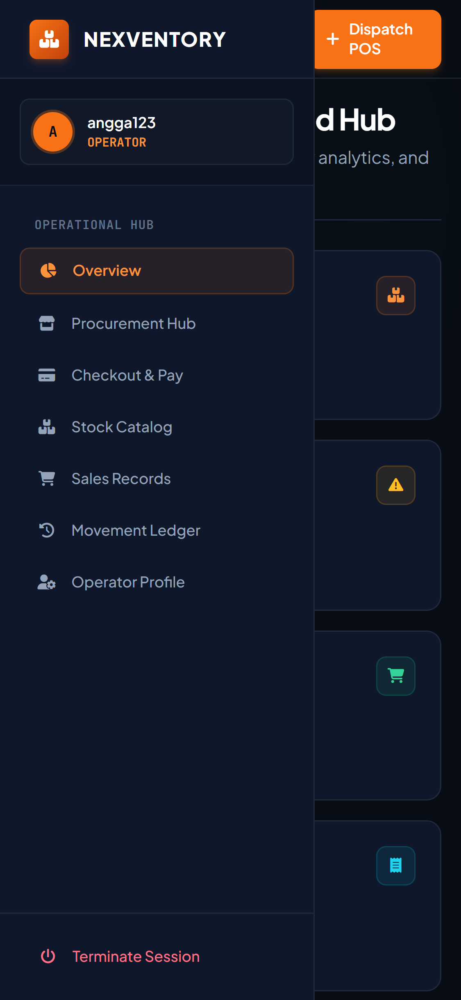
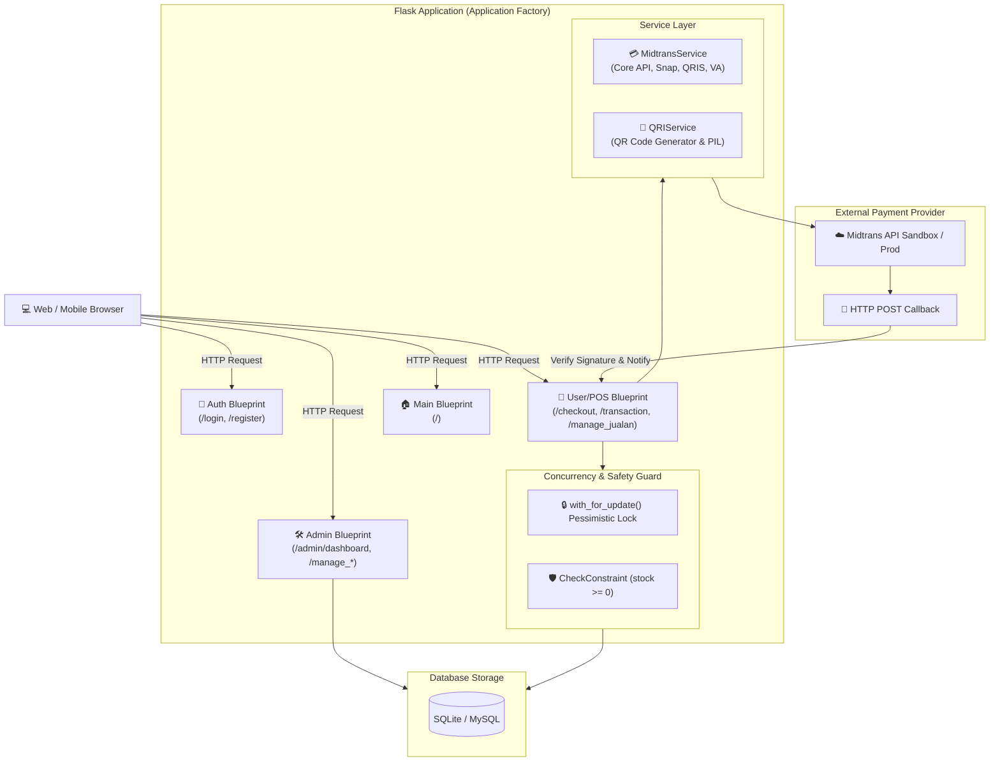

# 📦 Nexventory — Modern Inventory & POS Management System

<div align="center">

[](https://www.python.org/)
[](https://palletsprojects.com/p/flask/)
[](https://www.sqlalchemy.org/)
[](https://midtrans.com/)
[](LICENSE)
[](#)

**Nexventory** adalah sistem manajemen inventaris dan kasir digital *(Point of Sale / POS)* berbasis web yang dirancang untuk kecepatan, keandalan transaksi, dan kemudahan operasional bisnis modern. Dilengkapi integrasi **Payment Gateway Midtrans (QRIS & Virtual Account)**, mekanisme proteksi stok dari *race condition*, manajemen hak akses bertingkat *(RBAC)*, serta visualisasi data penjualan secara *real-time*.

[Fitur Utama](#-fitur-utama) • [Tangkapan Layar](#-tangkapan-layar) • [Arsitektur](#-arsitektur-sistem) • [Panduan Instalasi](#-panduan-instalasi--menjalankan) • [Konfigurasi](#-konfigurasi-environment-variables) • [Dokumentasi API](#-dokumentasi-terkait)

</div>

---

## 🌟 Fitur Utama

### 1. 📦 Manajemen Inventori & Stok Cerdas
- **Katalog Produk Lengkap**: Kelola nama, kategori, harga beli/jual, stok aktif, dan unggah foto produk.
- **Auto SKU Generator**: Format SKU otomatis berbasis kategori dan ID produk unik (contoh: `SKU-ELE-0001`).
- **Peringatan Stok Minimum *(Low-Stock Alert)***: Deteksi otomatis produk yang stoknya menipis (`stock <= min_stock`) langsung di dasbor.
- **Perlindungan Konkurensi *(Anti-Race Condition)***:
  - Menggunakan *pessimistic row-level locking* (`SELECT ... FOR UPDATE`) saat checkout pembayaran.
  - Lapisan pengaman *database constraint* (`CheckConstraint('stock >= 0')`), menjamin stok tidak pernah bernilai minus meskipun ribuan checkout terjadi serentak.

### 2. 💳 Kasir Digital *(POS)* & Payment Gateway Terintegrasi
- **Alur Checkout Dinamis**: Keranjang belanja interaktif dengan kalkulasi instan.
- **Midtrans Payment Gateway**:
  - **QRIS Dinamis**: Tampilan QR code siap pindai yang terverifikasi otomatis.
  - **Virtual Account (VA)**: Dukungan multi-bank (BCA, BNI, BRI, Mandiri, Permata).
- **Auto Settlement & Webhook Callback**: Penyesuaian stok dan pencatatan transaksi terjadi seketika saat notifikasi pembayaran diterima dari payment gateway.
- **Status Polling Real-Time**: Halaman checkout secara periodik memeriksa status pembayaran dan mengarahkan pengguna saat transaksi tuntas.

### 3. 📊 Dasbor Analitik & Riwayat Transaksi
- **Metrik Kinerja Bisnis**: Total omset/pendapatan, volume transaksi, jumlah pengguna, dan ketersediaan unit barang.
- **Audit Trail Lengkap**: Riwayat transaksi penjualan (*sale*) maupun pembelian (*purchase*) dengan detail timestamp, kasir pengelola, dan metode pembayaran.
- **Manajemen Penjualan**: Kemudahan menambah, memperbarui, dan membatalkan pesanan.

### 4. 🔐 Autentikasi & Keamanan Enterprise-Grade
- **Role-Based Access Control (RBAC)**: Pemisahan hak akses antara **Admin** (akses penuh inventaris, user, dan laporan) dan **User/Kasir** (akses transaksi dan checkout).
- **Pengamanan Kata Sandi**: Hashing menggunakan algoritma `pbkdf2:sha256:600000` dengan salt dinamis 16-byte.
- **Proteksi Brute-Force**: Penguncian akun otomatis setelah beberapa kali kegagalan autentikasi beruntun.
- **Token Keamanan**: Reset kata sandi dan verifikasi email berbasis token terenkripsi waktu (`URLSafeTimedSerializer`).

### 5. 🔄 Migrasi Basis Data Otomatis
- Didukung oleh **Flask-Migrate** dan **Alembic**.
- Skrip *auto-migrate* otomatis memeriksa dan menerapkan perubahan skema saat aplikasi dijalankan.
- Mendukung mode **SQLite** untuk kemudahan pengembangan lokal serta **MySQL / PostgreSQL** untuk lingkungan produksi.

---

## 📸 Tangkapan Layar

| Dasbor Utama Admin | Manajemen Produk & Stok |
| :---: | :---: |
|  |  |
| *Ringkasan statistik penjualan, stok kritis, dan aktivitas terkini* | *Katalog inventaris lengkap dengan indikator stok & aksi CRUD* |

| Halaman Checkout & Pembayaran QRIS | Manajemen Transaksi Global |
| :---: | :---: |
|  |  |
| *Pilihan pembayaran Midtrans QRIS & VA dengan timer kedaluwarsa* | *Audit log seluruh transaksi penjualan & pendapatan masuk* |

| Manajemen Penjualan Kasir | Form Tambah Transaksi Penjualan |
| :---: | :---: |
|  |  |
| *Antarmuka kasir cepat untuk input dan pantau transaksi harian* | *Form input transaksi penjualan langsung dengan kalkulasi total* |

| Manajemen Pengguna & Akun | Responsif di Perangkat Mobile |
| :---: | :---: |
|  |  |
| *Pengelolaan akun pengguna, status aktivasi, dan role sistem* | *Desain adaptif ramah pengguna di ponsel pintar dan tablet* |

---

## 🏗️ Arsitektur Sistem



---

## 🛠️ Tech Stack & Dependensi

| Layer | Komponen / Teknologi | Keterangan |
| :--- | :--- | :--- |
| **Backend Core** | Python 3.10+, Flask 2.3.3 | Kerangka kerja web mikro dengan arsitektur Application Factory |
| **ORM & Database** | Flask-SQLAlchemy 3.0.5, Alembic | Pemodelan relasi database dan migrasi skema terkelola |
| **Autentikasi** | Flask-Login 0.6.3, Werkzeug Security | Manajemen sesi pengguna dan hashing sandi standar PBKDF2 |
| **Payment Gateway** | Midtrans Client SDK 1.4.1, Requests | Integrasi transaksi QRIS dan Virtual Account perbankan |
| **Image & QR Processing** | qrcode[pil] 7.4.2, Pillow | Pembuatan QR Code dinamis beresolusi tinggi |
| **Frontend** | Jinja2, HTML5, Vanilla CSS3, JavaScript | UI interaktif modern tanpa ketergantungan library berat |
| **Testing** | Pytest | Pengujian fungsionalitas stok dan integritas konkurensi data |

---

## 📁 Struktur Direktori

```text
Nexventory/
├── app/
│   ├── __init__.py            # Application Factory & Blueprint Registration
│   ├── extensions.py          # Inisialisasi DB, LoginManager, Migrate, OAuth
│   ├── config/
│   │   └── payment_config.py  # Konfigurasi Midtrans, durasi QRIS, status code
│   ├── models/
│   │   ├── __init__.py        # Re-export model database
│   │   ├── db.py              # BaseModel helper kelas
│   │   ├── user.py            # Model User (RBAC, security, hash, lock)
│   │   ├── product.py         # Model Product (stok, SKU, CheckConstraint)
│   │   └── transaction.py     # Model Transaksi & relasi Midtrans
│   ├── routes/
│   │   ├── __init__.py
│   │   ├── auth.py            # Rute Login, Register, Logout
│   │   ├── admin.py           # Rute Dasbor Admin, Manajemen User & Produk
│   │   ├── user.py            # Rute POS, Checkout, Pembayaran & Webhook
│   │   └── main.py            # Rute Landing Page
│   └── services/
│       └── midtrans_service.py # Logika transaksi QRIS, VA, dan verifikasi status
├── assets/                    # Aset visual & tangkapan layar dokumentasi antarmuka
├── docs/
│   └── QRIS_API_Documentation.md  # Dokumentasi teknis endpoint pembayaran QRIS
├── instance/                  # Direktori penyimpanan SQLite database lokal
├── migrations/                # Versi skrip migrasi database (Alembic)
├── static/
│   ├── css/                   # Lembar gaya kustom dan tata letak UI
│   ├── images/                # Aset gambar statis antarmuka
│   ├── index.css              # Styling utama halaman landing
│   ├── qris/                  # Cache penyimpanan file gambar QR code dinamis
│   └── uploads/               # Direktori penyimpanan foto produk yang diunggah
├── templates/
│   ├── admin/                 # Template antarmuka administrator
│   ├── user/                  # Template kasir, katalog, dan checkout
│   ├── base.html              # Shell HTML utama
│   ├── index.html             # Landing page
│   ├── login.html             # Form autentikasi masuk
│   └── register.html          # Form pendaftaran akun baru
├── .env.example               # Contoh template konfigurasi environment
├── .flaskenv                  # Konfigurasi environment bawaan Flask CLI
├── app.py                     # Entry point dev server dengan auto-migration
├── auto_migrate.py            # Skrip otomatis sinkronisasi skema database
├── class.md                   # Penjelasan model kelas dan fungsinya
├── config.py                  # Pengaturan konfigurasi aplikasi (Dev / Prod)
├── init_db.py                 # Seeder awal (admin, user uji coba, produk demo)
├── migrate.sh                 # Skrip helper eksekusi migrasi database
├── MIGRATION_GUIDE.md         # Panduan lengkap pengelolaan migrasi database
├── requirements.txt           # Daftar dependensi paket Python
└── wsgi.py                    # Entry point untuk server WSGI (Gunicorn / uWSGI)
```

---

## 🚀 Panduan Instalasi & Menjalankan

Ikuti panduan di bawah ini untuk menjalankan Nexventory di komputer lokal Anda:

### 1. Prasyarat Sistem
- **Python 3.10** atau versi lebih baru
- **Git**
- *(Opsional)* **MySQL** atau **PostgreSQL** (jika tidak menggunakan SQLite default)

### 2. Kloning Repositori
```bash
git clone https://github.com/Lasains/Nexventory.git
cd Nexventory
```

### 3. Buat dan Aktifkan Virtual Environment
- **Windows (PowerShell / CMD):**
  ```powershell
  python -m venv .venv
  .venv\Scripts\activate
  ```
- **macOS / Linux:**
  ```bash
  python3 -m venv .venv
  source .venv/bin/activate
  ```

### 4. Pasang Dependensi
```bash
pip install -r requirements.txt
```

### 5. Siapkan Berkas Environment (`.env`)
Salin berkas `.env.example` menjadi `.env`:
```bash
cp .env.example .env
```
Sesuaikan nilai di dalam `.env` (terutama `SECRET_KEY` dan kredensial Midtrans jika ingin menguji pembayaran riil).

### 6. Inisialisasi & Seeding Database
Jalankan skrip `init_db.py` untuk menyiapkan tabel dan memuat data awal (akun default & produk contoh):
```bash
python init_db.py
```

### 7. Jalankan Server Aplikasi
```bash
python app.py
```
Aplikasi akan otomatis memeriksa status migrasi database dan berjalan pada:
👉 **`http://127.0.0.1:5000`**

---

## 🔑 Kredensial Uji Coba Default

Setelah menjalankan `init_db.py`, sistem menyediakan akun bawaan untuk pengujian:

| Akun Role | Username | Password | Hak Akses |
| :--- | :--- | :--- | :--- |
| **Administrator** | `admin` | `admin123` | Akses penuh: Dasbor analytics, kelola stok & produk, kelola akun pengguna, laporan omset. |
| **User / Kasir** | `user` | `user123` | Akses operasional: Katalog penjualan, keranjang belanja, checkout QRIS/VA, riwayat transaksi. |

---

## ⚙️ Konfigurasi Environment Variables

Berikut adalah daftar variabel konfigurasi yang tersedia pada berkas `.env`:

| Variabel | Tipe | Nilai Default | Penjelasan |
| :--- | :---: | :--- | :--- |
| `FLASK_APP` | String | `app.py` | Berkas titik masuk utama aplikasi Flask |
| `FLASK_ENV` | String | `development` | Lingkungan runtime (`development` / `production`) |
| `SECRET_KEY` | String | `dev-key-please-change` | Kunci enkripsi sesi pengguna dan token keamanan |
| `SQLALCHEMY_DATABASE_URI`| String | `sqlite:///instance/nexventory.db` | URI koneksi basis data (SQLite / MySQL / Postgres) |
| `MIDTRANS_SERVER_KEY` | String | *(Kunci Sandbox)* | Server Key resmi dari akun Midtrans |
| `MIDTRANS_CLIENT_KEY` | String | *(Kunci Sandbox)* | Client Key resmi dari akun Midtrans |
| `MIDTRANS_MERCHANT_ID` | String | *(Merchant ID)* | ID Merchant Midtrans terdaftar |
| `MIDTRANS_IS_PRODUCTION` | Boolean | `false` | `true` untuk mode produksi, `false` untuk mode sandbox |

> [!NOTE]
> Jika `SQLALCHEMY_DATABASE_URI` tidak diisi, sistem otomatis membuat dan menggunakan basis data lokal **SQLite** pada folder `instance/nexventory.db`.

---

## 🧪 Pengujian & Quality Assurance

Sistem dilengkapi pengujian unit otomatis, khususnya untuk menguji ketahanan **race condition pada pengurangan stok**:

```bash
# Menjalankan seluruh pengujian unit
pytest tests/

# Menjalankan pengujian konkurensi stok spesifik
pytest tests/test_stock_lock.py -v
```

Materi pengujian di `test_stock_lock.py` memvalidasi:
1. **DB CheckConstraint**: Menolak *update* bila nilai stok jatuh di bawah 0 (`IntegrityError`).
2. **Pessimistic Locking**: Memastikan pemrosesan pembayaran ganda terhadap unit barang yang sama diselesaikan berurutan secara konsisten.

---

## 📖 Dokumentasi Terkait

- [Dokumentasi API Pembayaran QRIS](docs/QRIS_API_Documentation.md) — Spesifikasi teknis payload JSON, endpoint generate, status polling, dan integrasi frontend.
- [Panduan Migrasi Database](MIGRATION_GUIDE.md) — Panduan pengoperasian Alembic dan skrip auto-migration database.
- [Dokumentasi Kelas Model](class.md) — Ikhtisar struktur model data ORM (`User`, `Product`, `Transaction`, `BaseModel`).

---

## 🤝 Berkontribusi

Kontribusi dari komunitas selalu diterima dengan senang hati! Silakan ikuti langkah-langkah berikut:

1. **Fork** repositori ini
2. Buat branch fitur baru (`git checkout -b fitur/fitur-keren`)
3. Lakukan commit perubahan Anda (`git commit -m "feat: menambahkan fitur keren"`)
4. Dorong ke branch Anda (`git push origin fitur/fitur-keren`)
5. Ajukan **Pull Request (PR)**

---

## 📄 Lisensi

Proyek ini didistribusikan di bawah lisensi **MIT License**. Lihat berkas [LICENSE](LICENSE) untuk informasi lebih lanjut.

<div align="center">
  <sub>Dikembangkan dengan dedikasi untuk efisiensi inventaris dan transaksi bisnis terpercaya.</sub>
</div>
